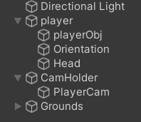
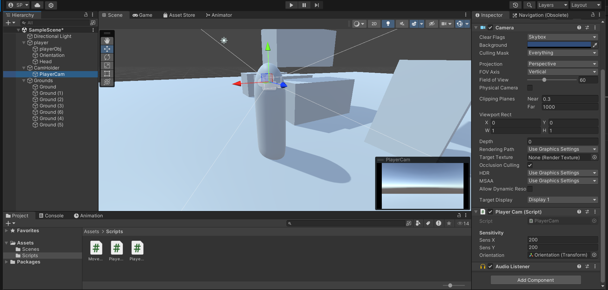
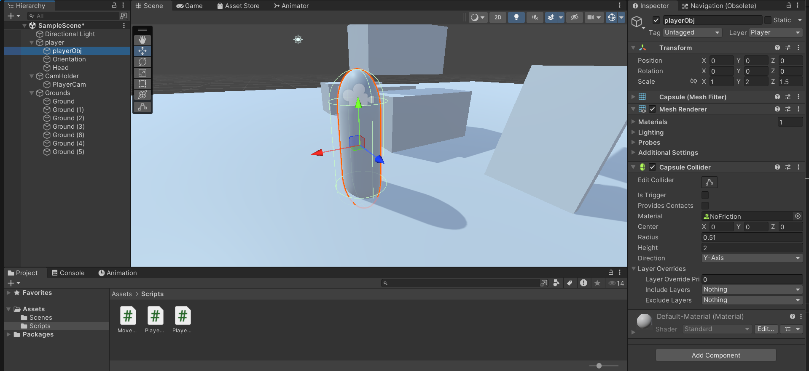
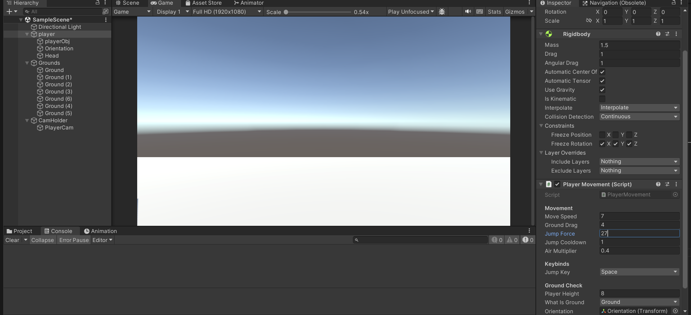

# Player Movement Script Series

This repository documents the creation of a player movement script in Unity, broken down into multiple parts. Part 1 includes basic walking, camera control, and jumping mechanics. Future updates will introduce more advanced features as I refine and expand the script. Stay tuned for ongoing improvements and additional functionalities!

## Project Hierarchy

To set up the project hierarchy:

1. **Create an Empty Parent Object:**
   - Name it `CameraHolder`.
   - Place the `MainCamera` inside this parent and rename it as desired.

2. **Create the empty Player Object:**
   - Create an empty object named `Player`.
   - Attach a `Rigidbody` component to the `Player` object (set it to `Continuous` and `Interpolate`).

3. **Add Player Components:**
   - Inside the `Player` object, create a capsule and attach a `Capsule Collider` component. Name it `PlayerObj`.
   - Add two more empty objects as children of the `Player` parent.

4. **Positioning:**
   - Position the `CameraHolder` and `CameraPos` at the top of the player’s head.

5. **Create a Ground Layer:**
   - Create a new layer called `Ground`.
   - Apply this layer to all objects you want the player to stand or jump on.

## MoveCamera Script

This script ensures that the camera follows the player.

- **Attach this script** to the `CameraHolder`.

## PlayerCam Script

The `PlayerCam` script handles the camera controls in the game. Here's how it works:

- **X-axis Rotation:** Both the camera and the player's body rotate.
- **Y-axis Rotation:** Only the camera rotates, keeping the player's body stationary.

- **Attach this script** to the main camera as shown below:

## PlayerMovement Script

This script manages the player's movement and interactions.

- **Attach this script** to the `Player` object (the parent with the `Rigidbody` component).
- **Optional:** Add a physics material with low settings to the player's body for better movement.

### Additional Settings

You can adjust the game's gravity in Unity's settings for better physics interactions.

